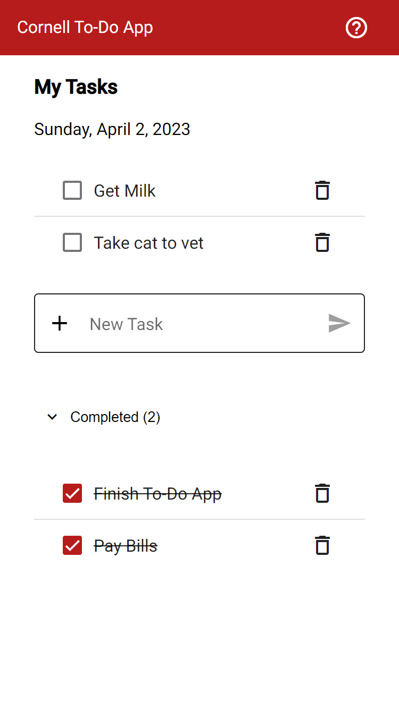

# Cornell To-Do App

Minimal To-Do Application for use across any device. A user can create tasks, mark tasks as complete/incomplete, and delete tasks. Follows [Material Design 2 Guidelines](https://m2.material.io/), with room for additional feature development.

This project was built using [Angular CLI](https://github.com/angular/angular-cli) version 15.2.4, and [Angular Material](https://material.angular.io/) version 15.2.5.

Tech Used:

- Angular CLI
- Angular Material
- Typescript
- RxJS
- SCSS
- HTML
- Jasmine & Karma (unit testing)

## Installation

Install Angular CLI

`npm i -g @angular/cli`

Install Project Dependencies

`npm i`

## Development server

Run `ng serve` for a dev server. Navigate to `http://localhost:4200/`. The application will automatically reload if you change any of the source files. Source components and files located in `src/` directory.

## Build

Run `ng build` to build the project. The build artifacts will be stored in the `dist/` directory.

## Running unit tests

Run `ng test` to execute the unit tests via [Karma](https://karma-runner.github.io).
